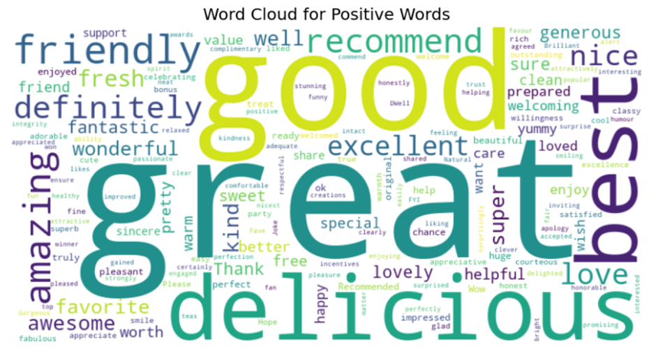
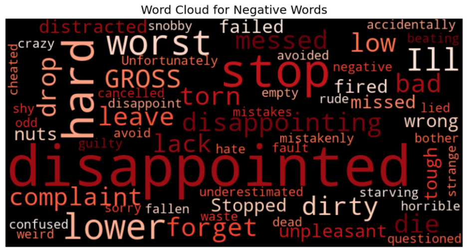
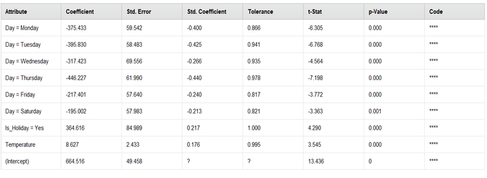

# Reviving Restaurant Revenue Using Predictive Analytics & Customer Insights
*Identified key revenue drivers and customer experience gaps, recommending strategies to increase revenue by 10–15%*

---

## Business Problem / Context
A local Thai restaurant in Abbotsford faced declining revenue and inconsistent customer satisfaction. The goal was to use sales, weather, and customer review data to identify key drivers and provide actionable recommendations to improve performance.

---

## Data Sources
- 313 days of POS sales data  
- Weather and holiday data  
- 400+ Google reviews  

---

## Tools & Techniques
- **SQL:** Data extraction & aggregation  
- **Python (Pandas, NLTK):** Data cleaning, exploratory analysis, sentiment analysis  
- **Power BI (DAX):** Interactive dashboards  
- **Techniques:** EDA, Regression Modeling (Multiple Linear Regression), NLP, Sentiment Analysis  

---

## Approach
1. Cleaned and merged structured (sales, weather) and unstructured (customer reviews) datasets  
2. Explored trends in revenue, item-level sales, and tipping patterns  
3. Built Multiple Linear Regression model to forecast daily revenue based on temperature, day-of-week, and holidays  
4. Performed sentiment analysis to quantify customer feedback and link it to tipping behavior  
5. Developed interactive Power BI dashboard for decision-making  

---

## Key Insights
- **Low-performing days:** Thursdays had the lowest revenue → opportunity for targeted weekday promotions  
- **Weather sensitivity:** Warm days and holidays drove higher revenue  
- **Staff impact on service:** Negative sentiment after staff changes correlated with ~20% drop in tips  
- **Loyalty drivers:** Friendly service and food quality were the top reasons customers returned  
- **Operational inefficiencies:** Low-performing menu items added complexity without meaningful revenue contribution  

---

## Business Recommendations
- Launch weekday promotions and event tie-ins to boost slow days  
- Focus on high-margin menu items and optimize low-performing ones  
- Retrain staff and implement QR-based feedback channels to improve service quality  
- Introduce seasonal/holiday promotions to leverage peak demand  
- Use predictive insights for staffing and inventory planning  

---

## Business Impact
Implementing these strategies could increase revenue by **10–15%**, improve customer satisfaction, and reduce operational inefficiencies — all achievable with minimal overhead.

---

## Dashboards & Visualizations
-   
  *Interactive dashboard showing revenue trends, KPIs, and operational insights*

-   
  *Highlights frequent positive customer feedback*

-   
  *Highlights recurring negative service issues*

-   
  *Multiple Linear Regression model showing key revenue drivers*

---

---

## Learnings
This project strengthened my ability to translate raw data into actionable business insights, communicate findings effectively through dashboards, and apply predictive and sentiment analysis to real-world business problems.
